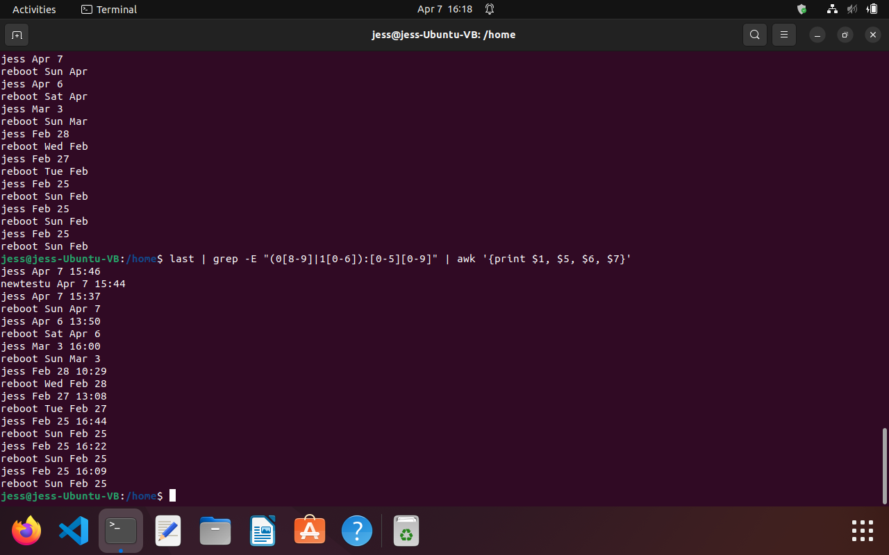
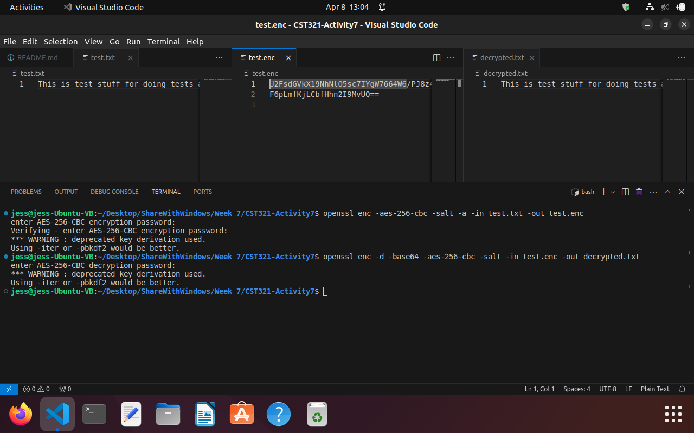
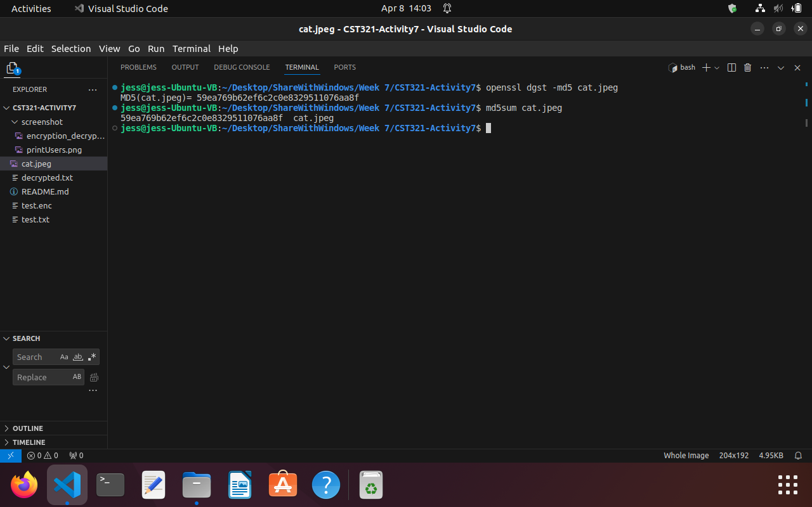
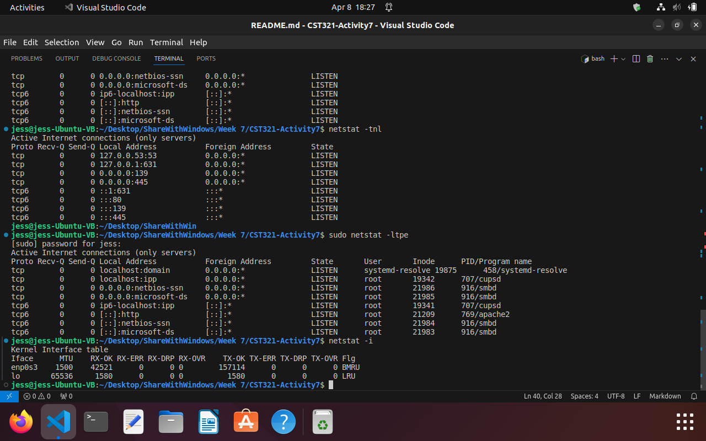

# CST321-Activity7

### Basic Security
Added a new user, changed the group they belong to, then deleted the user.  This screenshot shows all the users that have logged in after normal business hours using the last command and then piping it into the grep command to search for the time, then piping it into awk to print out the specific items in the leftover string:
```last | grep -E "(0[8-9]|1[0-6]):[0-5][0-9]" | awk '{print $1, $5, $6, $7}'```


Some areas that possibly need to be hardened in a Linux server are:
- User authentication: require strong passwords and limit users access
- Network services: ensure only necessary services are running
- File system permissions: restric access to files

Configuration file that need to be hardened:
- etc/ssh/sshg_config: SSH server config file for remote access
- etc/sudoers: Limit privileged commands
- ect/sysctl.conf: Kernel parameters config file for tuning

Tools that would be helpful:
- Security scanning tools
- Real-time threat detection
- File integrity checking
- Log management

### Working with OpenSSL
#### Encryption and Decryption
```openssl enc -aes-256-cbc -salt -a -in test.txt -out test.enc``` was used to create an encrypted file using AES and Base64 and uses the salt option for more randomness to encode.
```openssl enc -d -base64 -aes-256-cbc -salt -in test.enc -out decrypted.txt``` was used to create a new decrypted file.  The main difference in the commands is the -d option for decrypt.


#### Create Password
```openssl passwd myPassword``` creates an encrypted password 'myPassword'.

#### Encrypt Image
Create a MD5 Hash on the image file by running ```openssl dgst -md5 cat.jpeg```.
Create a MD5 Hash on the image file by running ```md5sum cat.jpeg```.


Steganography is a way to hide data.  This could be used in text, image, video, audio, and over a network.  In an image, the pixels could be altered to hide data.  For example, modifying the last bit of each of the pixel data doesn't modify the look of the image, but can be used to hide data.  It can be used to send messages or add a type of watermarking.

A hash like MD5 (or better, SHA-256) could be used to prevent steganography because it provides a way to double check the file.  When a file is modified, the MD5 hash will change.  We can compare the hash with the original to ensure that it was not modified.  

### Network Utilities
Several commands are helpful at configuring and displaying info about networks.
- ```ifconfig -a``` used to configure and display info about network interfaces. It retrieves details about all network interfaces like the IP addresses.  Useful for network admin to configure and verify the status of all interfaces.
- ```netstat -a``` used to display network related info like connections and interface stats.  It's similar to the ifconfig -a, but can be used to retrieve real time traffic.
- ```netstat -at``` like the last command, but used to filter the output to display only TCP connections. Helpful for admin to analyze TCP issues.
- ```netstat -tnl``` filters the output to display only listening TCP connections.  Helpful for admin to verify that only authorized services are listening.
- ```sudo netstat -ltpe``` displays listening TCP connections with the process names, PIDs, and user IDs.  Helpful for admin to identify security risks such as unauthorized services that are running on the system.  
- ```netstat -i``` displays info about the network interfaces like their name, transmission unit sizes, and traffic stats.  It can help admin verify that the network interfaces are configured properly.



### Ethical Hacking
Some different types of hacking are:
- Website Hacking: taking unauthorizzed control over web server.
- Network Hacking: gathering info about a network to harm the system.
- Email Hacking: getting unauthorized access of an email account.
- Ethical Hacking: for testing and fixing vulnerabilities.
- Password Hacking: recovering passwords that have been stored in a computer system.
- Computer Hacking: stealing computer IDs and passwords to gain access to a computer system.

Some tools that are used to hack are:
- NMAP: I just used this during the last section to look at all of the connections on my local network.  It is used to gather information about what hosts are available, what OSs are running, and what type of firewalls are in use.  
- Metasploit: Used to discover the network data and run spot checks on the vulnerabilities.
- SuperScan: Perform ping scans, merge port lists, connect to any open port.

Some different types of attacks are: 
- Trojan: appear like regular apps or link in an email, but they create a backdoor for the hackers to access the system.
- DDoS: disrupts the availability of services by overwhelming networks with a flood of traffic.
- Email Hijacking: attackers gain access through phishing, brute force, or malware.

Tools and training to work in the security field:
- Proxy servers, VPNs, Firewalls
- Courses in cybersecurity
- Collaboration with other professionals